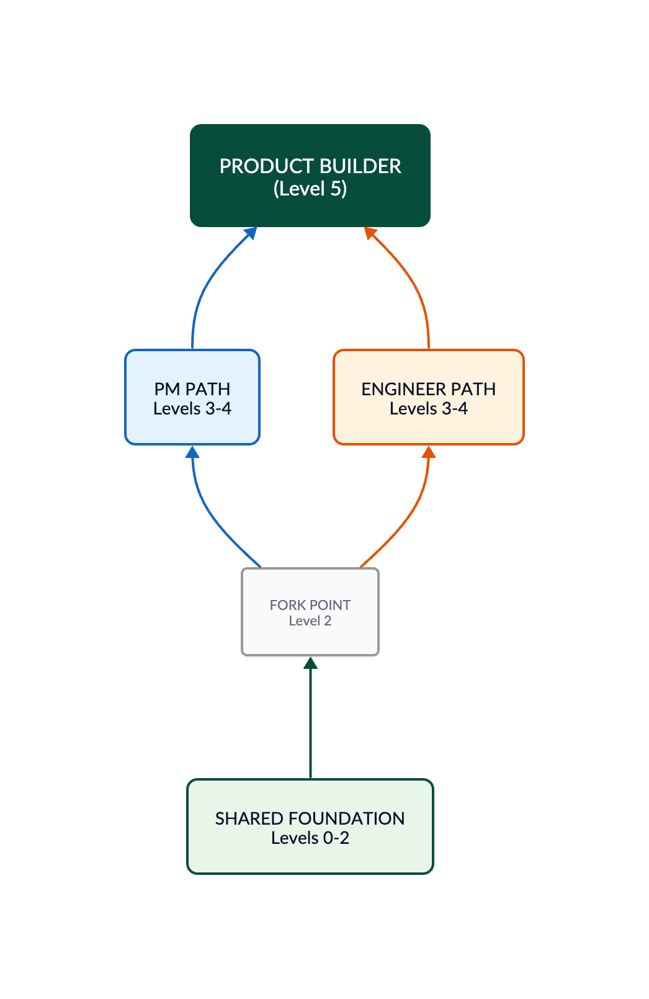

The Product Builder is not a job title. It is a capability state where an individual can independently convert customer problems into deployed, operating solutions.

Two paths converge at this destination: Product Managers who acquire technical depth, and Engineers who acquire product judgment. This article defines the maturity levels for both paths, the critical transitions between them, and the infrastructure required at each stage.

The evolution follows a clear arc: from "works on products" to "builds products" to "owns product outcomes."

---

## The Convergence Model

Most maturity models assume a single origin point. The Product Builder model recognizes two:

**PM Path**: Product Managers who develop technical fluency—moving from specifications to prototypes to production systems.

**Engineer Path**: Engineers who develop product judgment—moving from implementation to user understanding to business ownership.

Both paths share foundational levels (0-2). At Level 2, they fork into parallel tracks before converging at Level 5: Product Builder.

This dual-path structure reflects what's happening across the industry. As Andrew Ng observed in early 2026:

> "I've seen engineers successfully expand their roles to including making product decisions, and PMs expand their roles to building software. The tech industry has more engineers than PMs, but both are promising paths. If you are an engineer, you'll find it useful to learn some product management skills, and if you're a PM, please learn to build!"

The best product builders come from both backgrounds. What matters is not where you start, but whether you acquire the capabilities required for end-to-end ownership.

---

## Maturity Dimensions

Progress is measurable across five dimensions:

| Dimension                  | Early (0-1)     | Mid (2-3)          | Advanced (4-5)                |
| -------------------------- | --------------- | ------------------ | ----------------------------- |
| AI Usage                   | Chat assistance | Agentic workflows  | Autonomous systems            |
| Technical Depth            | No-code         | Scripts/prototypes | Production architecture       |
| Product Ownership          | Specs/features  | Working MVPs       | End-to-end systems            |
| Execution Speed            | Ideas           | Experiments        | Continuous delivery           |
| Operational Responsibility | Inputs          | Features           | Reliability/business outcomes |

A useful executive lens is the **dependency curve**—how much the individual relies on specialists to ship:

| Level                   | Dependency on Specialists         |
| ----------------------- | --------------------------------- |
| 0 - Observer            | 100%                              |
| 1 - Operator            | 90%                               |
| 2 - Prototype Builder   | 60%                               |
| 3 - Technical Builder   | 30%                               |
| 4 - Production Engineer | 10%                               |
| 5 - Product Builder     | Near-zero for many product classes |
| 6 - Platform Leader     | Builds leverage for others        |

---

## Shared Foundation: Levels 0-2

These levels are common to both PM and Engineer paths.

### Level 0 — Observer

**"AI is interesting."**

#### Behaviors

- Uses AI for summarization and brainstorming
- Generates documents, notes, basic content
- Treats AI as a smarter search engine
- Experiments casually without systematic approach

#### Tools

- ChatGPT, Claude, Gemini
- Basic Notion AI, Google Workspace AI features

#### Output

- Faster documentation
- Incremental productivity gains
- Better first drafts

#### Metrics

- Documents completed with AI assistance (vs. baseline)
- Self-reported time saved on routine tasks
- Quality ratings on AI-assisted deliverables

#### Key Shift

None yet. AI is a curiosity, not a capability multiplier.

#### Limitation

Fully dependent on others to validate and build ideas.

---

### Level 1 — Operator

**"I can direct AI to create artifacts."**

#### Behaviors

- Writes structured, reusable prompts
- Chains prompts together for complex outputs
- Uses AI across multiple tool categories
- Creates workflows, not just queries
- Generates flows, queries, copy, analysis

#### Tools

- Figma AI, Miro AI, Notion AI
- SQL generation tools, analytics query builders
- Structured prompt libraries
- Perplexity, ChatGPT with browsing

#### Output

- Faster planning and discovery
- Higher quality artifacts
- Repeatable AI workflows

#### Metrics

- Reusable prompts/workflows created and adopted by others
- Artifacts produced per planning cycle
- Reduction in discovery phase duration
- Stakeholder satisfaction with deliverable quality

#### Key Shift

Moves from "ask AI questions" to "direct AI workflows."

#### Limitation

Still dependent on others to convert artifacts into working systems.

---

### Level 2 — Prototype Builder

**"I can turn ideas into working experiences."**

This is the first major inflection point and the fork between paths.

#### Behaviors

- Builds clickable, functional prototypes independently
- Creates lightweight internal tools
- Iterates on UX without specialist dependency
- Tests customer workflows with real interfaces
- Validates hypotheses before engineering investment

#### Tools

- Lovable, Bolt, v0, Replit
- Cursor, Windsurf (early usage)
- Low-code platforms: Retool, Bubble, Glide

#### Technical Capability

- Basic frontend understanding (HTML, CSS, JavaScript concepts)
- Can read and edit generated code
- Understands APIs conceptually
- Comfortable with UI state and flows

#### Output

- Functional demos
- Internal MVPs
- Customer validation prototypes
- Design specs backed by working code

#### Metrics

- Prototypes shipped before engineering involvement
- Ideas validated or invalidated before engineering investment
- Customer validation sessions conducted with working prototypes
- Engineering rework reduction (fewer spec changes post-handoff)

#### Key Shift

The individual becomes "dangerously independent." Ideas become testable without waiting for engineering.

#### Limitation

Cannot reliably manage production complexity, reliability, or scale.

---

## The Fork Point

At Level 2, individuals choose their path.

### Option A: AI-Augmented PM (Terminal PM State)

For those who want to remain in product management:

- Continues to validate with working prototypes
- Hands off to engineering for production
- Specs become demos, not documents
- Massive reduction in engineering waste and iteration cycles
- Does not own production systems or operational responsibility

**This is a legitimate, high-value terminal state—not a lesser outcome.** It represents the most effective version of the traditional PM role.

### Option B: Continue to Product Builder

For those who want end-to-end ownership, the path continues through Levels 3-5.

---

## PM Path: Levels 3-4

For Product Managers continuing toward Product Builder.

### Level 3 (PM Path) — AI Developer

**"I can work directly in code with AI assistance."**

#### Behaviors

- Uses terminal and repositories confidently
- Reads stack traces, logs, error messages
- Modifies backend logic with AI guidance
- Understands package managers, environments, deployments
- Uses AI agents to implement scoped features
- Debugs with AI assistance

#### Tools

- Claude Code, Cursor, Windsurf, GitHub Copilot
- Git workflows, GitHub/GitLab
- Basic cloud platforms: Vercel, Railway, Render, Netlify
- Database tools: Supabase, PlanetScale, Neon

#### Technical Capability

- Git version control
- REST APIs and SDKs
- Database basics (queries, schemas)
- Authentication concepts (OAuth, JWT)
- Environment configuration (.env, secrets management)
- Basic deployment (CI/CD concepts)

#### Output

- Real working applications
- Internal production tools
- AI-powered features
- Self-directed technical iteration

#### Metrics

- Features shipped without engineering handoff
- Internal tools deployed and actively used
- PRs merged to production repositories
- Reduction in engineering support requests for owned features

#### Key Shift

Stops thinking in "requirements" and starts thinking in "systems and implementation constraints."

#### Limitation

Production quality, reliability, and security still require guidance.

---

### Level 4 (PM Path) — AI Product Engineer

**"I can ship production-grade product experiences."**

#### Behaviors

- Owns architecture decisions with awareness of tradeoffs
- Uses production SDKs and APIs correctly
- Builds robust, reliable AI workflows
- Designs evaluation and monitoring systems
- Handles observability, analytics, error tracking
- Makes cost/performance tradeoff decisions

#### Tools

- OpenAI, Anthropic, and other AI SDKs
- Vercel, Supabase, Cloudflare Workers, AWS basics
- Monitoring: Sentry, LogRocket, Datadog
- Analytics: PostHog, Amplitude, Mixpanel
- Feature flags: LaunchDarkly, Statsig

#### Technical Capability

- Production authentication and authorization
- Rate limiting, caching, performance optimization
- Prompt engineering and evaluation
- Error handling and graceful degradation
- Security fundamentals (OWASP basics, input validation)
- Cost awareness and optimization

#### Output

- Customer-facing production systems
- Revenue-generating AI features
- Operationally stable products
- Scalable internal tools

#### Metrics

- Production systems launched and maintained
- System uptime (SLA achievement)
- Customer-facing features shipped end-to-end
- Revenue or usage attributed to shipped features
- Mean time to resolution for owned systems

#### Key Shift

Understands that shipping is not the finish line—operating is.

#### Limitation

Deep infrastructure, scaling challenges, and complex distributed systems still require specialists.

---

## Engineer Path: Levels 3-4

For Engineers building product judgment.

### Level 3 (Engineer Path) — Product-Aware Engineer

**"I understand users and can make product decisions."**

#### Behaviors

- Talks to users directly and synthesizes feedback
- Makes product tradeoff decisions independently
- Prioritizes based on user impact, not just technical elegance
- Understands positioning and competitive context
- Designs features with user outcomes in mind
- Questions requirements rather than just implementing

#### Skills to Acquire

- User research fundamentals (interviews, surveys, usability testing)
- Prioritization frameworks (RICE, ICE, MoSCoW)
- Basic UX principles (heuristics, accessibility)
- Competitive analysis methods
- Outcome vs output thinking

#### Output

- Features designed for user impact
- Self-directed product decisions
- Reduced PM dependency for scoping
- Better requirement generation

#### Metrics

- Product decisions made independently (without PM escalation)
- User research sessions conducted
- Features shipped with self-authored requirements
- User satisfaction scores on shipped features
- Reduction in scope change requests during development

#### Key Shift

Moves from "build what's specified" to "solve the user problem."

#### Limitation

May lack strategic context, market awareness, or business model understanding.

---

### Level 4 (Engineer Path) — Full-Stack Product Engineer

**"I own the complete product experience."**

#### Behaviors

- Defines what to build, not just how
- Owns user experience end-to-end
- Understands unit economics and business viability
- Makes GTM-aware technical decisions
- Designs for adoption, not just functionality
- Balances technical debt against product velocity

#### Skills to Acquire

- Business model understanding (SaaS metrics, LTV, CAC)
- GTM basics (positioning, pricing, channels)
- Design thinking and prototyping
- Product analytics and metrics definition
- Roadmap prioritization and stakeholder management

#### Output

- Complete features from conception to launch
- Products designed for business outcomes
- Technical decisions aligned with strategy
- Self-sufficient product delivery

#### Metrics

- End-to-end features shipped without PM involvement
- Business metrics moved (activation, retention, revenue)
- Self-initiated features that reached production
- Adoption rate on shipped features
- Time from idea to shipped feature

#### Key Shift

Understands that code is a means, not an end. User outcomes are the measure.

#### Limitation

Operating at scale, organizational dynamics, and platform thinking may require growth.

---

## Convergence: Levels 5-6

Both paths merge here. The distinction between PM-origin and Engineer-origin disappears.

### Level 5 — Product Builder

**"I own product outcomes end-to-end."**

This is the major identity transition. The person is no longer a PM using AI or an engineer with product sense. They are a builder with product judgment.

#### Behaviors

- Ships continuously and iterates based on data
- Owns deployment pipelines and release processes
- Operates products in production
- Monitors business and technical metrics together
- Balances UX, architecture, economics, and reliability
- Makes tradeoffs across all dimensions
- Responds to incidents and user feedback directly

#### Tools

- Full CI/CD: GitHub Actions, Vercel, Railway
- Infrastructure: AWS, GCP, or Cloudflare stack
- Observability: Datadog, Grafana, PagerDuty
- Product analytics: PostHog, Amplitude
- Customer feedback: Intercom, Linear, Canny
- Cost management: AWS Cost Explorer, Infracost

#### Technical Capability

- Production infrastructure management
- Incident response and debugging
- Performance optimization at scale
- Security hardening and compliance basics
- Multi-environment deployment strategies
- Data pipeline fundamentals

#### Responsibilities

- Production ownership and uptime
- Incident response and remediation
- Growth loops and retention mechanics
- AI evaluation and improvement systems
- Customer telemetry and feedback integration
- Cost governance and unit economics

#### Output

- Standalone products
- New business lines
- AI-native experiences
- Self-sustaining product operations

#### Metrics

- Products operating independently (no dedicated engineering support)
- Business outcomes achieved (revenue, active users, retention)
- Uptime and reliability (SLA achievement on owned products)
- Customer satisfaction (NPS, support ticket volume)
- Unit economics health (margin, cost per user)
- Incident response time and resolution rate

#### Key Shift

The unit of work changes from "feature delivery" to "business outcomes."

---

### Level 6 — Platform Leader

**"I design organizations and systems that compound."**

#### Behaviors

- Builds reusable platforms, tools, and agents
- Creates internal AI leverage for the organization
- Orchestrates teams of humans and AI agents
- Defines company-wide product development patterns
- Designs for multiplication, not addition
- Mentors and grows other builders

#### Tools

- Platform infrastructure: Kubernetes, Terraform
- AI orchestration: LangChain, custom agent frameworks
- Internal tooling: Retool, custom admin systems
- Documentation: Notion, Confluence, internal wikis
- Team coordination: Linear, Jira, custom dashboards

#### Technical Capability

- Platform architecture and API design
- Multi-tenant system design
- AI agent orchestration patterns
- Developer experience optimization
- Organizational systems thinking

#### Responsibilities

- Platform architecture and evolution
- Team capability development
- AI agent orchestration systems
- Organizational operating models
- Multi-product strategy

#### Output

- AI-native product organizations
- Autonomous product operations
- Multi-product ecosystems
- Compounding organizational capability

#### Metrics

- Builders enabled (people using your platforms/tools)
- Platform adoption rate across organization
- Time-to-productivity for new builders
- Organizational velocity improvement (features shipped per builder)
- Reuse rate (components, patterns, agents adopted across teams)
- Builder satisfaction with internal platforms

#### Key Shift

No longer primarily builds features or products. Builds platforms, workflows, and operating systems for product development.

---

## Critical Transitions

Moving between levels is not continuous improvement—each transition requires specific changes that can feel like regression before the benefits materialize.

### Transition 1: Prompting → Building (Level 1 → 2)

The individual learns state management, UI mechanics, APIs, and debugging. This is usually where confidence explodes. They realize they can test ideas without waiting.

### Transition 2: Prototype → Production (Level 2 → 4)

The hardest leap. Production requires reliability, security, maintainability, observability, and deployment discipline. It requires caring about users you'll never meet, at times you're not working, in conditions you didn't anticipate.

This is where CLI tools and AI coding agents matter enormously.

### Transition 3: Shipping → Operating (Level 4 → 5)

The rarest capability. Many people can launch. Few can sustain. Ownership extends beyond launch. Monitoring and response become daily activities. Economic thinking integrates with technical decisions.

Operating production systems changes how you think forever.

---

## Path Asymmetries

The two paths are not equally difficult for all product types.

| Product Type | Shorter Path |
|--------------|--------------|
| Technical/infrastructure products | Engineer path |
| Consumer/UX-heavy products | PM path |
| B2B SaaS | Depends on complexity |
| AI-native products | Converges quickly |

The model should not imply equal difficulty. Context matters.

---

## Implications

The Product Builder represents a fundamental shift in how software gets made. As AI compresses implementation barriers, value shifts to:

- Clear specification of intent
- Comprehensive validation design
- Operational ownership
- Business outcome accountability

The question is not whether individuals will need to become more capable across traditional role boundaries. The question is which path they take to get there—and whether they choose to stop at a legitimate intermediate state or continue to full end-to-end ownership.

Both are valid choices. The model provides the map for either journey.

---

## References

- Ng, Andrew. "AI-Native Teams and Evolving Roles in Product Development." *The Batch*, Issue 349. DeepLearning.AI. January 2026. https://www.deeplearning.ai/the-batch/issue-349

---

*This is a living document. Last updated May 2026. Submit feedback at productbuildershq.com.*
